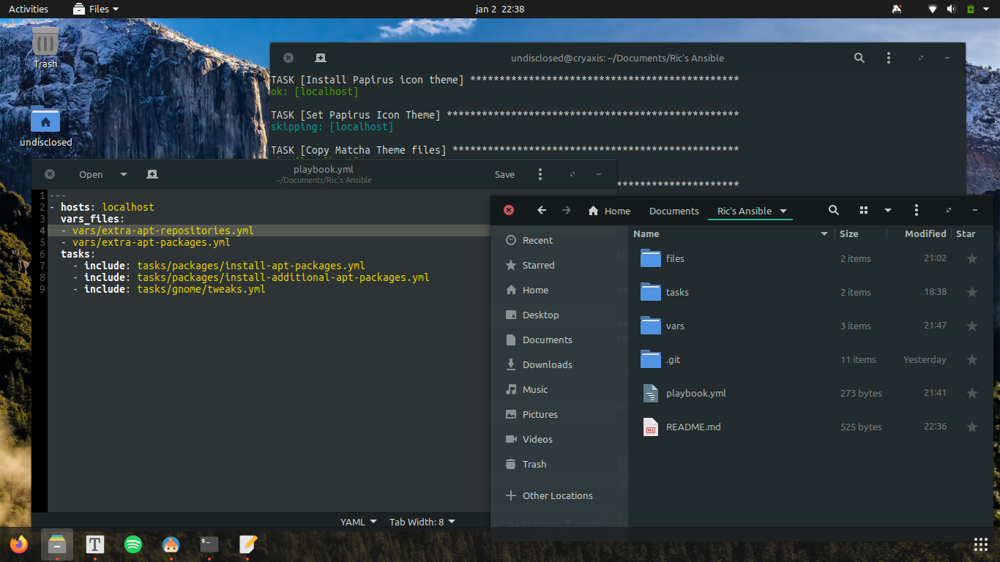

# ubuntu-desktop-setup

An Ansible Playbook for setting up new Ubuntu-based Desktop systems.


## Usage

- Install Ansible

  ```sh
  sudo apt install ansible
  ```

- Clone this repository to a place of choice, obviously.

- Execute the Ansible playbook

  ```sh
  ansible-playbook -K playbook.yml
  ```

  `-K` will ask for the become root password, as some changes requires root access, like installing apt packages and system themes.


## Result

Various applications have been installed. System theme should be set up. Application icons are different. Text editor has a different theme. Window buttons have been changed to prevent accidental closing. Text scaling has been altered. Dock has been placed on the bottom, uses smaller icons and it hides automatically. A desktop background has been added.



